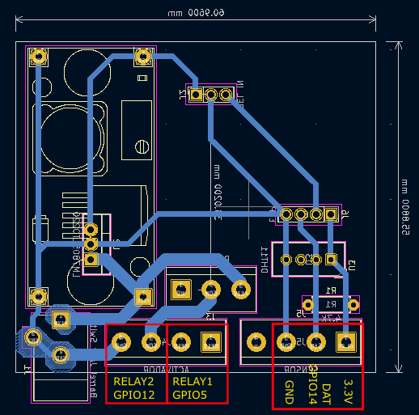
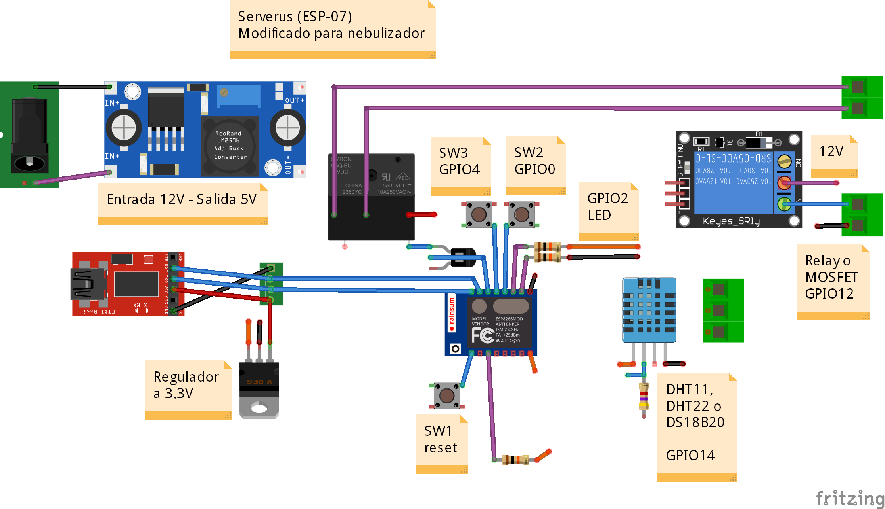

# Nebulizador
Serverus modificado para controlar un nebulizador.  

Se agregó una placa para colocar conectores y cables.  

GPIO utilizados  
5 Relay interno  
12 Relay externo o MOSFET  
14 Sensor DHT11, DHT22 o DS18B20  

