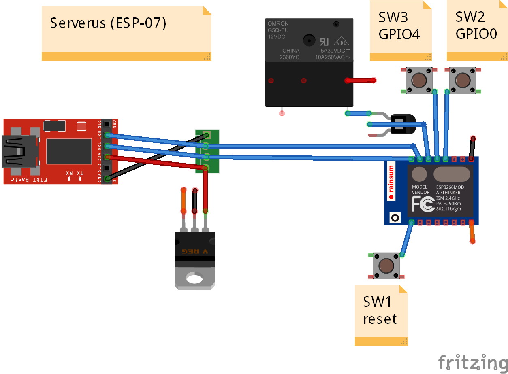

# Serverus
Control de acceso IoT

El mismo dispositivo se ha adaptado para controlar otras cosas.  
Por ejemplo https://github.com/Inventoteca/Concentrador-IoT_MedidorTanque  

Otro ejemplo está en la carpeta "Nebulizador"  
https://randomnerdtutorials.com/esp8266-pinout-reference-gpios/  
https://randomnerdtutorials.com/esp8266-ds18b20-temperature-sensor-web-server-with-arduino-ide/  
https://randomnerdtutorials.com/esp8266-dht11dht22-temperature-and-humidity-web-server-with-arduino-ide/  

Diagrama simplificado (WIP)  

